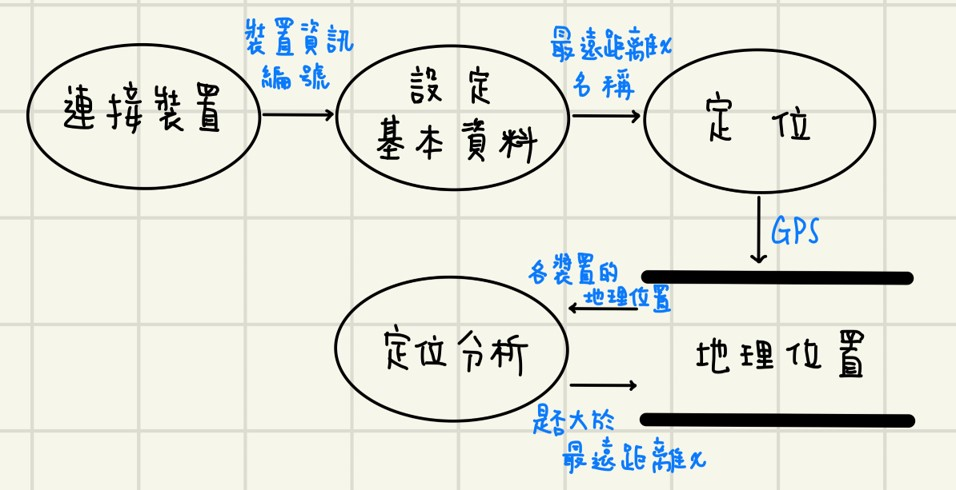
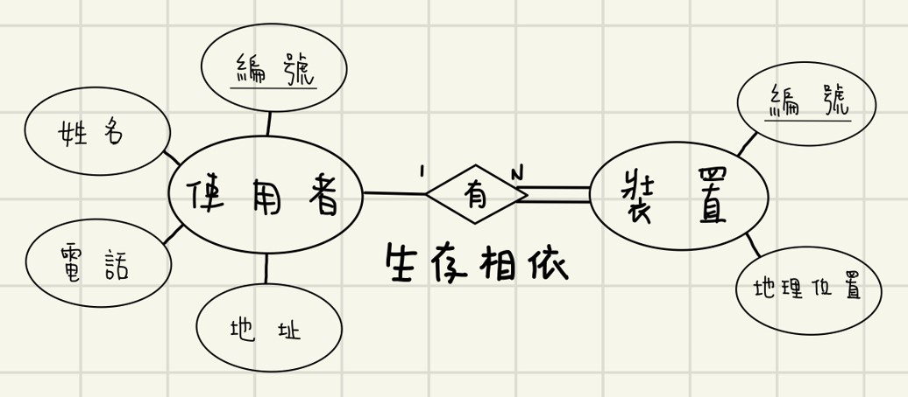
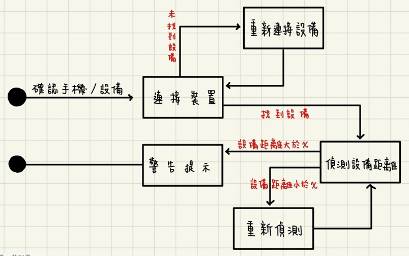
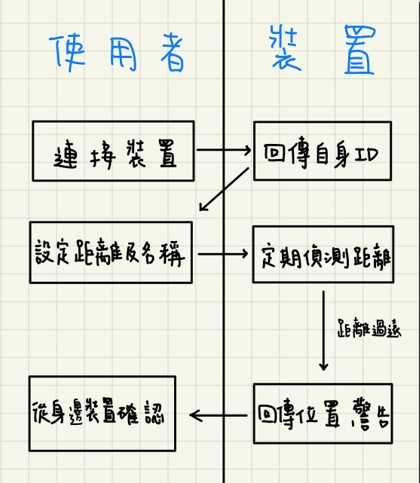
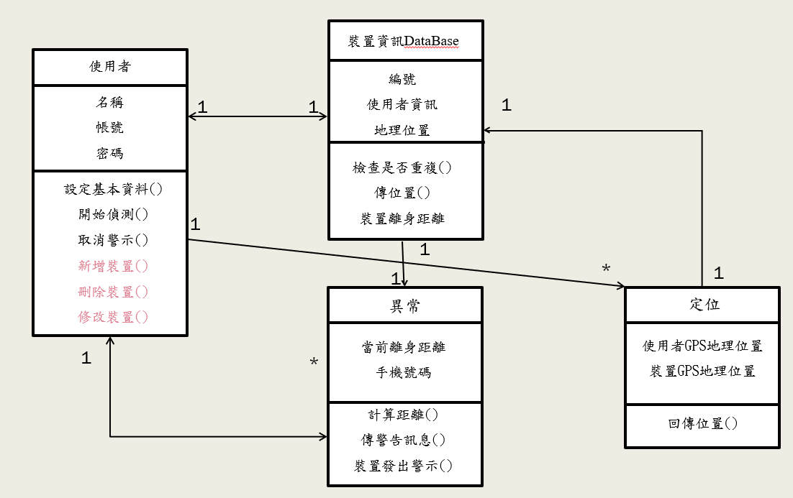
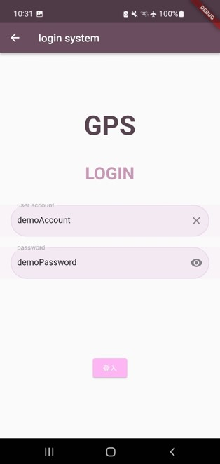
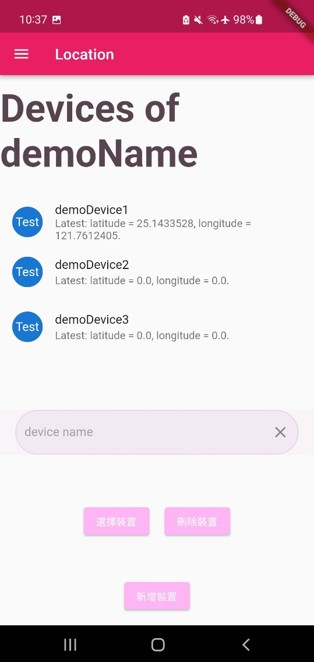
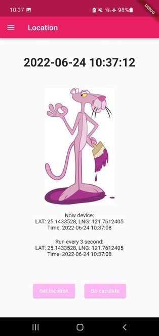

# 軟工期末專案 --- 裝置定位異常偵測系統

#### 陳濰暄、葉之霆、關羽辰、張祐琪、張耕瑋 ####

## 主要負責
裝置定位、登入註冊系統、UI

## 大概介紹
偵測裝置的地理位置並且計算兩台裝置的距離

## 動機
> 當你擁有多部裝置時
> 如果有其中一部裝置距離你身邊的裝置超過一定距離時
> 會發出異常警告訊息，提醒你確認

> 當你帶著需要被照顧的家人出門時
> 可以藉由此裝置來確認他們是否走丟，並尋找他們

## 需求分析

- 資料流程圖(DFD)

- 實體關聯圖(ERD)

- 狀態轉換圖

- 企業流程圖

- 需求規格書
上面的word檔

## UML圖

## 實作結果圖

- 登入介面

- 裝置管理

- 裝置定位

- 距離計算
